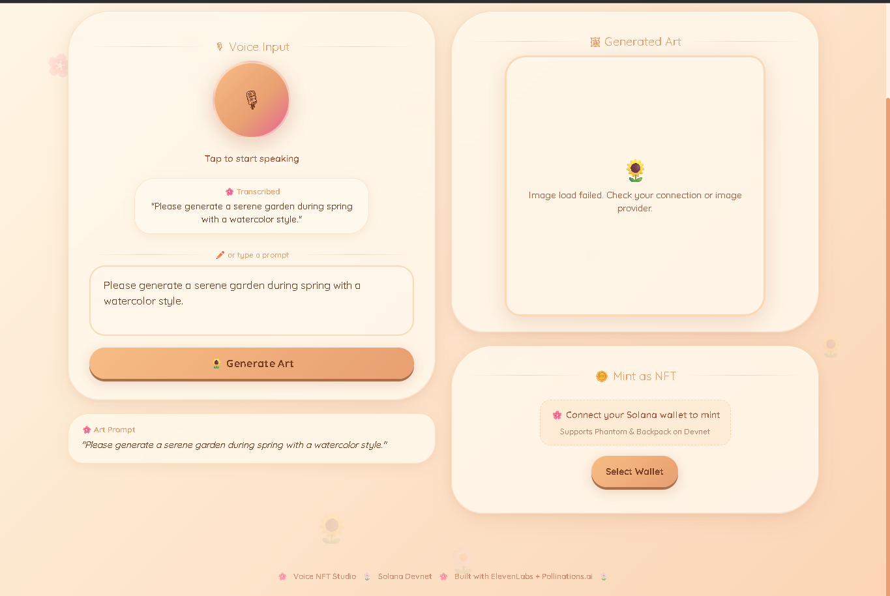
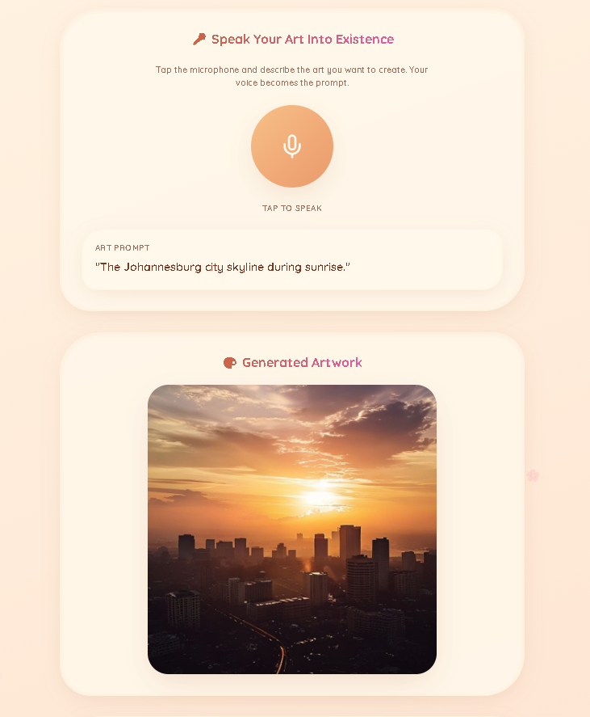
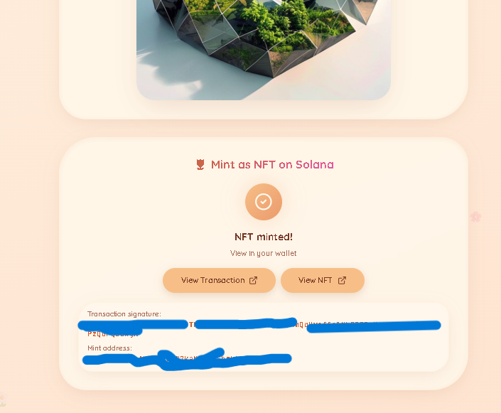
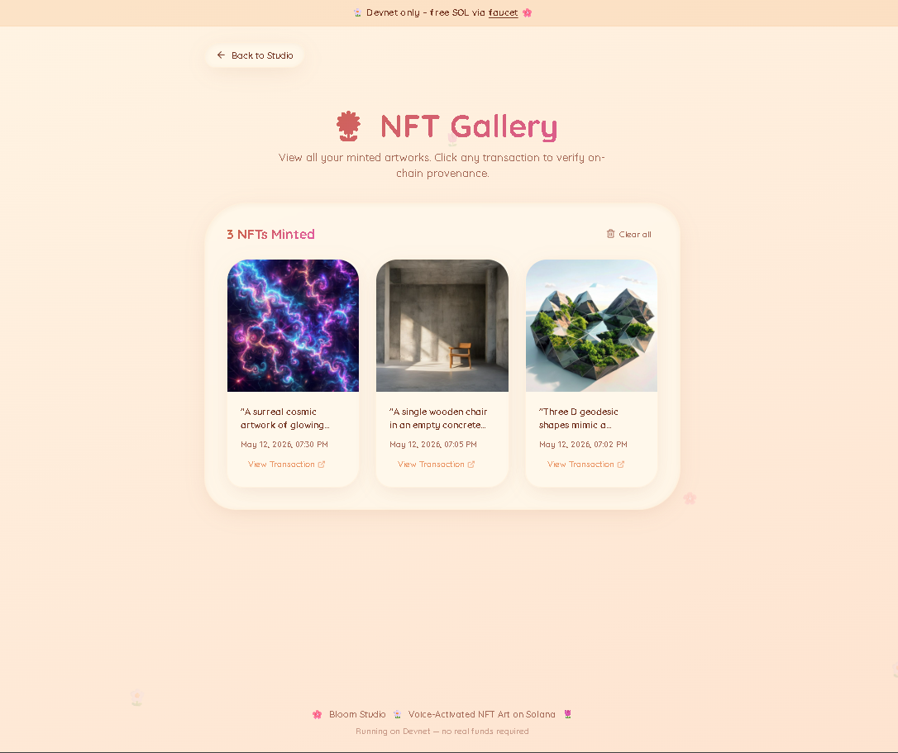
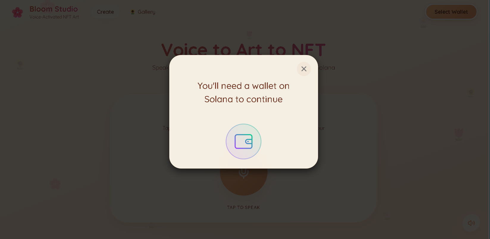

# Voice NFT Studio

A React + Vite demo app that turns spoken prompts into AI-generated artwork and mints the result as a Solana NFT on Devnet.

## What it does

- Records voice from your browser.
- Transcribes speech into text using ElevenLabs STT.
- Generates an image from the transcribed prompt via Pollinations.ai.
- Reads back status and prompt via text-to-speech (ElevenLabs or browser fallback).
- Mints the generated artwork as a Solana NFT on Devnet using Metaplex UMI.
- Stores a local gallery of minted NFTs in browser localStorage.

## 📸 Screenshots

### **Main Studio** – Voice recording + image generation + minting 

### **Voice Recording, Transcribed Prompt & AI Generated Image** – Image appears from your voice description 

### **Mint Success** – Transaction signature and NFT confirmation 

### **Wallet Gallery** – All minted NFTs saved locally

### **Wallet Connection** – Phantom wallet connected on Devnet 


---

## Key features

- Voice recording and speech transcription
- AI prompt-to-image generation
- Solana wallet integration with Phantom / Backpack style wallet adapters
- Minting on Solana Devnet with on-chain metadata stored as data URI
- Local gallery and transaction signature display
- Mute/unmute TTS feedback

## Tech stack

- React + TypeScript
- Vite
- Tailwind CSS
- Solana wallet adapter
- Metaplex UMI + mpl-token-metadata
- ElevenLabs speech-to-text / text-to-speech
- Pollinations.ai image generation

## Prerequisites

- Node.js 18+ / npm
- A Solana wallet extension (Phantom, Backpack, or other compatible wallet)
- Devnet SOL in the connected wallet
- ElevenLabs API key for STT/TTS (optional, browser TTS fallback works if missing)

## Setup

1. Install dependencies:

```bash
npm install
```

2. Create a `.env.local` file in the project root.

3. Add your ElevenLabs API key:

```env
VITE_ELEVENLABS_API_KEY=your_elevenlabs_api_key_here
```

> If you do not provide `VITE_ELEVENLABS_API_KEY`, the app will still run, but voice transcription and TTS may use browser fallbacks or fail depending on the feature.

## Run locally

```bash
npm run dev
```

Then open the URL shown by Vite (usually `http://localhost:5173`).

## Build

```bash
npm run build
```

Preview production output:

```bash
npm run preview
```

## How to use

1. Open the app in your browser.
2. Connect your Solana wallet.
3. Record your voice prompt.
4. Wait for transcription and image generation.
5. Mint the generated artwork as an NFT on Solana Devnet.
6. View minted NFTs in the gallery.

## Environment variables

- `VITE_ELEVENLABS_API_KEY`: ElevenLabs API key for speech-to-text and text-to-speech.

## Notes

- This app is configured for Solana Devnet only.
- **NFT metadata:** The on-chain mint stores the generated image URL directly, keeping transaction payloads small enough for reliable browser wallet signing. This avoids the `WalletSignTransactionError: encoding overruns Uint8Array` issue that occurs with large base64 metadata URIs.
- The image generation flow uses `https://image.pollinations.ai` and does not require a paid API key. If the direct request is blocked by CORS, a proxy fallback (`images.weserv.nl`) automatically retries the fetch.
- Minted NFT history is saved in browser localStorage under `bloom_studio_nfts`.

## Project structure

- `src/pages/Index.tsx` — main app flow and UI orchestration
- `src/pages/GalleryPage.tsx` — dedicated gallery view for minted NFTs
- `src/components/` — UI components for voice input, image preview, minting, gallery, and layout
- `src/lib/elevenlabs.ts` — ElevenLabs STT/TTS integration
- `src/lib/imageGen.ts` — prompt-to-image generation with proxy fallback
- `src/lib/mintNFT.ts` — Solana Devnet minting logic using Metaplex UMI
- `src/lib/nftStorage.ts` — local gallery persistence
- `src/hooks/` — custom React hooks for wallet balance, voice recording, and toasts

## Troubleshooting

### Wallet Sign Error: "encoding overruns Uint8Array"

**Problem:** Minting fails when you click the mint button.

**Solution:** This has been fixed by storing the image URL directly on-chain instead of a large base64 metadata URI. Ensure `src/lib/mintNFT.ts` uses `uri: metadataUri` where `metadataUri` is the generated image URL (not a data URI).

### Image Generation Returns 403 or Times Out

**Problem:** Pollinations API returns 403 or the image fetch hangs.

**Solution:** The app automatically falls back to a proxy (`images.weserv.nl`). If both fail, check:
- Browser console for detailed error messages
- Your internet connection
- Pollinations service status at `https://pollinations.ai`

### "Insufficient SOL Balance" Error

**Solution:** Get free Devnet SOL from https://faucet.solana.com. You need at least 0.01 SOL.

### Voice Transcription Not Working

**Solution:** Ensure `VITE_ELEVENLABS_API_KEY` is set in `.env.local`. Without it, the app attempts browser-native speech recognition (may be limited or unavailable on some browsers).

## License

This project is provided as-is for demo and prototyping purposes.
